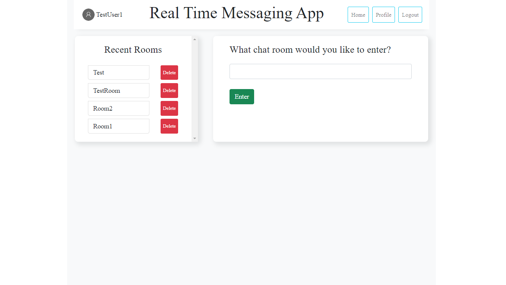
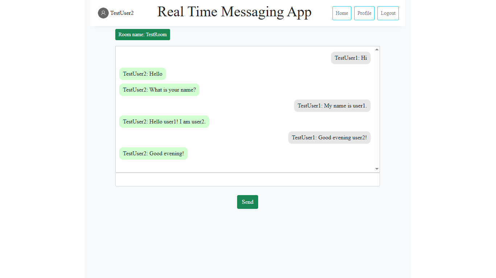
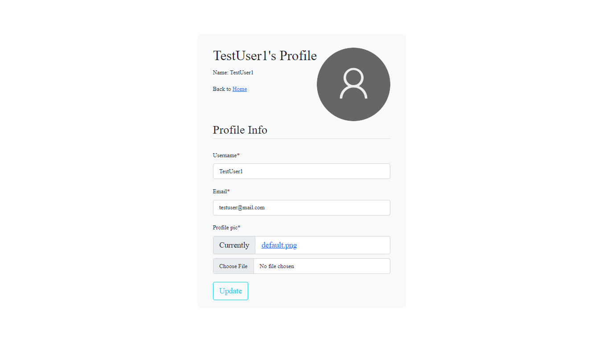
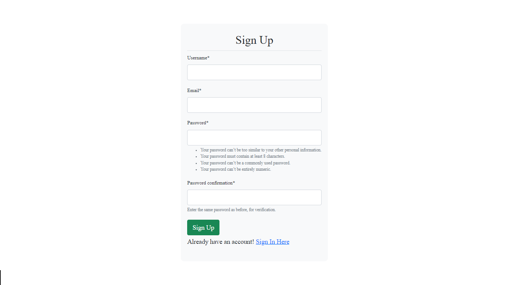
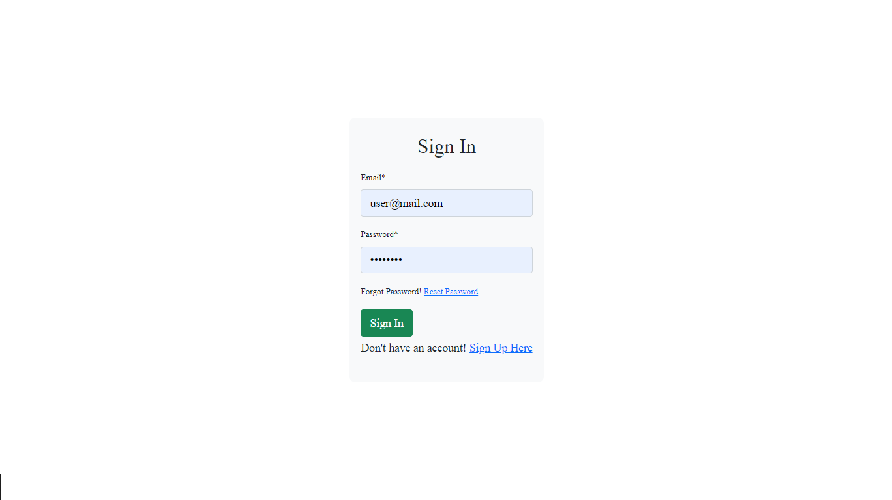
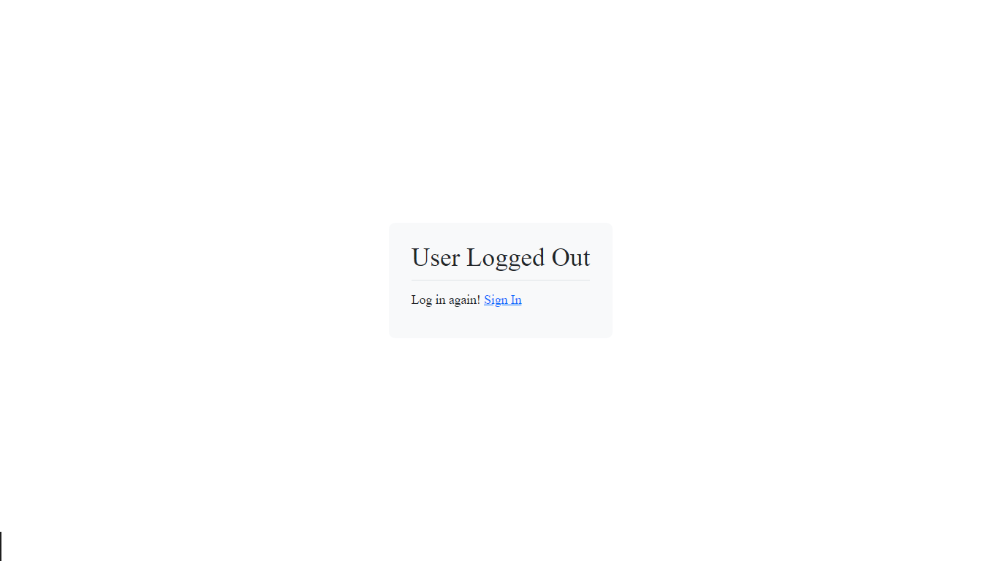

# Real-Time Chat Application

##### This is a real-time chat application built with Django and Django Channels and Websocket.

## Features
 - Real-time messaging: Send and receive messages instantly.
 - Chat rooms: Users can create, delete or join different chat rooms.
 - User authentication: Secure login and signup.
 - Message history: Messages are saved in the database, allowing users to see previous conversations.
 - WebSockets: Powered by Django Channels for real-time communication.

## Tech Stack
- Backend: Django, Django Channels, WebSocket
- Frontend: HTML, CSS, JavaScript
- Database: SQLite
- Authentication: Django's built-in authentication system
  
## Usage
1. Sign up or log in to your account.
2. Create or join a chat room.
3. Start sending messages in real time.

## Project Screenshots
Here are some screenshots of the real-time chat application.

Home page

Chat Room

User profile page

Registration page

Login page

Logout page

